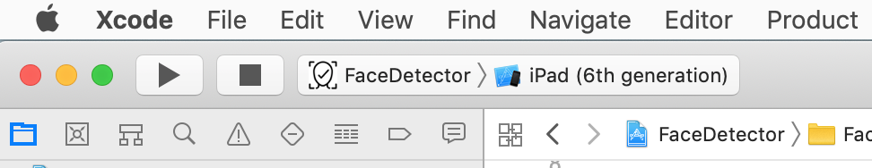
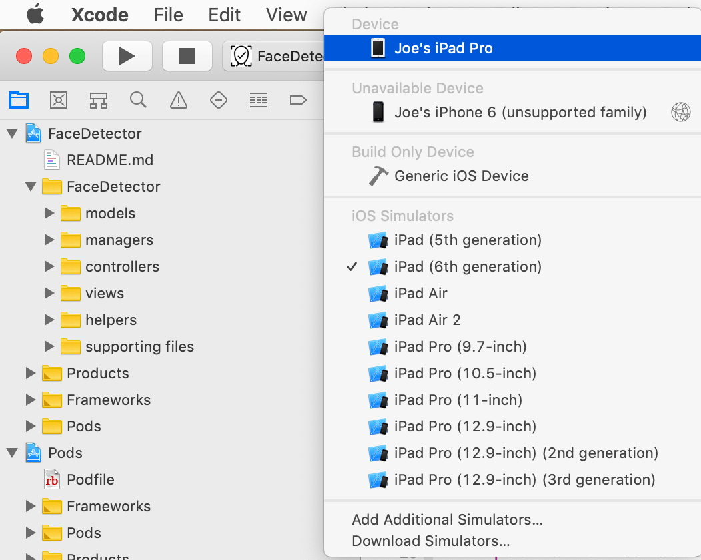
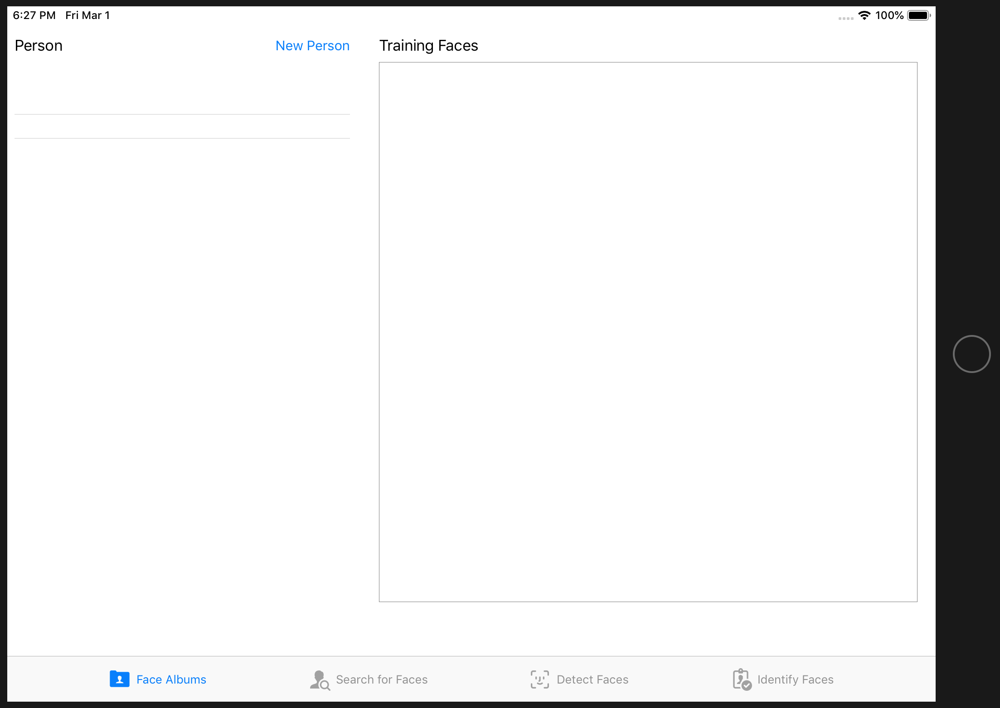
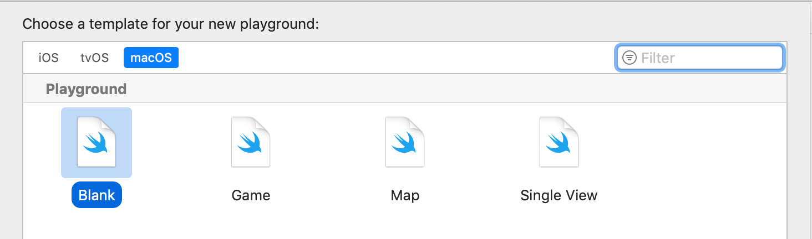
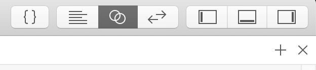

# Face Detector Example Project
### Presented to the SoCal iOS Meetup Group
### February 20, 2019 / Joe Mestrovich

This example project demonstrates how to use images from the internet to train a convolutional neural network for facial recognition. Images will be gathered using an open-sourced web scraper, optimized for training, and used to build a neural network with the CreateMLUI framework from Apple. The project application will help manage all the training and verification images as well as test the user created CNN.

## Dependencies

This app uses the [`Kingfisher`](https://github.com/onevcat/Kingfisher) library to download and cache images from the web. To open this project in Xcode, use the **FaceDetector.xcworkspace** project file so that the Kingfisher CocoaPods integration is correct.

[`Google Images Download`](https://github.com/hardikvasa/google-images-download), a standalone Python script, is used to gather image URLs from the internet. To install the script, open the Terminal app on your Mac (found inside the **Utilities** folder in **Applications**) and enter:

`pip install google_images_download`

If the installation fails, please visit the project [`README.md`](https://github.com/hardikvasa/google-images-download) file for additional installation instructions.

>Note: This app is designed to run on an iPad and is best used with an actual device, but you can use it through the *Simulator*. Check the console output for the phrase *“Root URL located at:”* when you start the app in the *Simulator*. This will point you to the semi-temporary document directory for the simulated iPad. Copy the path and select **Go to Folder…** from the **Go** menu in the Finder. Paste in the path that you copied from the console and press **Go**. A new finder window will open to the root of the application document directory and from here you can access all of the files you will need to train your neural network. Alternatively, you can also access the app directory through the **Files** app, but it is somewhat easier to use the Finder window instead.

## How to Build Your Own Face Recognizer

This application stores all of its data into files. Before you begin acquiring training images, you need to initialize the directories that the application will need. To do that, simply install and run the app on your device (or simulator). Begin by connecting your iPad to your Mac and select your device from the *Active Scheme” pop-up menu.

Select your iPad or choose an iPad simulator.

Run the app by pressing the right triangle. You should eventually get a screen like this:

Press the **New Person** button and enter a name for a person you would like to have your neural network recognize. If you like, you can do this for additional people.

Exit the iPad app by pressing the Home button and open the **Files** app. From the **Browse** panel, select the **“On My iPad”** row to show the **Face Detector** folder. Tap to open it and you should find folders for all of the people you created a moment ago.

## Next Step: Find Links to Photos on the Internet

On your Mac, open the **Terminal** app (found inside the **Utilities** folder in **Applications**). In the window, navigate to a directory (folder) where you would like to store your search results. An excellent location would be your **Downloads** folder. From here you will run the *Google Images Download* script you installed earlier. 

Note: An easy way to get to your **Downloads** folder from the **Terminal** window is to type:

`cd /users/YOUR-USER-NAME/downloads`

Replace **YOUR-USER-NAME** with your computer login account short name. Not sure what your account name is? Type `cd /users` and press **Return**. Type `ls` and press **Return**. You will see a list of user names. Find your account name and use that with the example above.

To collect URLs, type:

`googleimagesdownload --keywords "CELEBRITY NAME" -p -nd >> "CELEBRITY NAME urls.txt"`

Replace **CELEBRITY NAME** with the name of the person you would like images for. Be sure to do that in both places in the example above. All of the text in lowercase is required. Press **Return** to start the search process.

>If you would like to learn more about the command you just typed, visit the [`README.md`](https://github.com/hardikvasa/google-images-download) document for the Python script.

When the script is finished running, you should find a new *.txt* file in your **Downloads** folder. If you examine it you will find a collection of about 100 different URLs pointing to pictures of the person you targeted. Run the same command for all of the other people you wish to search for.

## Copy Your Search Results into the App Folders

You now need to move the files you created into the respective people folders so the *Face Detector* app can find them. 

Begin by copying your search files out of your **Downloads** folder and dropping them into your **iCloud Documents** folder. Placing the files here makes them easy to access on your iPad.

Next, run the **Files** app on your iPad and select the **iCloud Drive** row from the **Browse** panel. Open the **Documents** folder and find your search files. Hold your finger down on a search file for about a second and release. You should find a list of options appear above the file. Select the **Copy** option. Tap the **On My iPad** row from the **Browse** panel and open the **Face Detector** folder. You should see all of the people folders you created earlier. Select the folder for the person you built a search file for. Tap the **FaceCandidateFiles** folder to open it. Press the area below the folders (the empty space) for about a second and then select the **Paste** option. This will drop a copy of your search file where the *Face Detector* app expects to find it.

Repeat this process for all of the remaining search files.

## Assign Your Training Images

Revisit your *Face Detector* app and select a person from the list in the **Face Albums** tab. Tap the **Search for Faces** tab. The app has now found the search file you you installed earlier and is retrieving all of the images in the list. You may notice that some images take a while to download and some may never show up at all. This is typical of image retrieval because not all websites choose to freely share.

You will now select images for training or verification purposes. Training images will be used to help your neural network learn the facial characteristics of the person you are have targeted and should be a majority of your assignments. Verification images are used to test your neural network after it has been trained. Keep an eye out for images that have your subject posed with other people or somehow presented unusually. These make for more interesting tests later.

To select one or more images for training, tap images to place a green checkmark over the picture. Tap a selected image again to unselect it, if necessary. Find the **Move Selected to Training** button to the right and tap it. The images you selected should now be moved into the **Training Photos** section. The process is similar for filling the **Verification Photos** section. Notice the three buttons below the list of unassigned images. The **Delete Selected** button will permanently delete selected images. **Select All** will save you time by marking every image in the list. Press **Deselect All** to clear all selections.

You do not have to assign every image in your list or finish in one session. You can switch to making training assignments for another person at any time. The app will also save your progress when you exit. You may add to your search list by copying additional search files into the app folders.

Continue this process for all of the people you wish your CNN to recognize. The more training images you provide, the better the neural network will be at recognizing faces. Also notice that the images in the verification section are shared as you switch from one person to another. 

>The **Google Custom Search** bar above the search images is not active by default. An early version of this app used the *Google Custom Search API* to find images, but the accuracy and suitability of the returned images was too poor to use. For those interested, the source code still contains the API call for you to explore.

## Detect and Select Faces

The **Detect Faces** tab will use the training images you assigned earlier to extract a face for training. Tap a thumbnail image to display a larger version of the picture and signal the app to extract a face from that picture. If there is more than one face found, you must select the face that best matches your targeted person. Press the **Use Selected Face for Training** to save the extracted face for later training and remove the selected image from the list.

The **Batch Assign Training Faces** button will attempt to automatically extract and save training faces for all of the pictures in your list. If the app finds more than one face in an image, it will skip processing it so that you can later evaluate it.

Extract and save faces for all of the people you want for your CNN. You can return to this tab at any time to continue the process or add additional faces to your training list. Also note that you can review your selected faces now in the **Face Albums** tab.

## Train the Neural Network

Begin by gathering the training and test faces for all of your people. Tap the **Face Albums** tab and locate the **Add to Training Set** button. Tap the button for each person you would like the neural network to identify. Notice that 20% of the training faces are allocated for testing.

Exit the *Face Detector* app by pressing the **Home** button on your iPad. Run the *Files* app and tap on the **On My iPad** row in the **Browse** panel. Open the **Face Detector** folder and find the **Test Set** and **Training Set** folders. Copy these to your **iCould Drive** location (a good place to park them is in the **Documents** folder).

You will now begin the process of training your own CNN. Go to your Mac and start **Xcode**. From the project dialog box or the **File** menu, create a new playground. Be careful to select the **macOS** option and **Blank** template (otherwise *Xcode* will seem unresponsive when you try to build a CNN). Press **Next** and give your playground file a name.

When the editor appears, click the **Assistant Editor** button in the upper right-hand side of the window (be careful to set this correctly otherwise the next step will fail).

Delete the sample code in the editor and replace it with this:

`import CreateMLUI`

`let builder = MLImageClassifierBuilder()`

`builder.showInLiveView()`

Just below the last line in the code you entered, notice a small circled triangle button. Press this to invoke the neural network builder user interface. After a moment you should see the following in the right-hand pane:

Open a *Finder* window and drag your **Training Set** folder into the dashed space labeled **Drop Images To Begin Training**. *Xcode* should quickly flash pictures of your faces as they are processed by the training engine. When it is complete, you will get a report about the accuracy of the training session.

The final training step is to drop a copy of your **Test Set** into the dashed space labeled **Drop Images To Begin Testing**. When it is finished testing you will get another report and a list of images you can scroll through to verify the accuracy of the training.

Congratulations! You have successfully built a convolutional neural network! Don’t worry if your CNN seems to be a little inaccurate; we will address this later.

## Copy Your CNN into the Face Detector App

This final step will customize your copy of the *Face Detector* app with the neural network you just built. Begin by renaming the CNN. Click on the label **ImageClassifier** so that it shows an editing field around the text. Replace it with `CelebrityFaces` and press **Return**. It is important to get the spelling accurate otherwise the *Face Detector* app may not compile.

Next to the label is a small downward pointing caret button. Press it expose a **Save** button. The default save location is your local *Documents* folder, but you may place it anywhere you like by selecting the **Where** option. Save your CNN.

You can now close the playground window. *Xcode* may ask you if you wish to save the playground. It is not required for you to save it.

Open the *Face Detector* **FaceDetector.xcworkspace** project file in *Xcode*. In the left-hand panel, find the **FaceDetector** folder and open it. You should see a **models** folder inside. Open that to expose an old version of the **CelebrityFaces.mlmodel** CNN. Select it and delete it to the trash. 

Open a *Finder* window and locate your new neural network. Position windows so that you can drag you new neural network into the space formerly occupied by the old CNN. This can be a bit tricky—you need to drag your CNN directly below the **model** folder so that it is seated inside of it. You can confirm if you successfully dragged it into the folder by closing the **model** folder. If your new CNN seems to disappear into the folder, then you have placed your file successfully.

Connect your iPad to your Mac and verify that your iPad appears in the *Active Scheme” pop-up menu. Run the app.

## Test your CNN

Tap on the **Identify Faces** tab at the bottom right-hand corner of your iPad. You should see a row of thumbnail images that you selected earlier as verification photos. Select an image and notice how the app will detect and classify the faces it finds. The classification success is based on how well your CNN was trained. Sometimes a larger number or greater variety of images is required to improve accuracy. Also notice that the neural network insists on classifying every face it detects as one of the people it has been trained with.

Have fun exploring and thinking through the classification decisions the CNN is making. You can add additional verification images from the **Search for Faces** tab to further challenge your neural network (you may also want to conduct additional searches using the *Google Image Search* tool).

## How to Improve Your CNN

Adding more images helps. Vary your search requests so that it’s more than just a name. For example, “Lady Gaga concert” or “Lady Gaga awards ceremony”. It can be helpful to open a browser window and experiment with search terms using the *Google Images* website.

Before dragging your training images into the neural network builder, press the downward pointing caret to expose training options.

From here you can specify how many training iterations to conduct. Usually, the more, the better, but there is an upper bound to improvement. Also, you can alter the images it trains with by introducing alterations, such as a skew or blur. These help to simulate a greater variety of images.

If you want better control over your files, or to delete people or training faces, use the **Files** app to make changes. In general, the *Face Detection* app will try its best to rebuild directories as necessary.

## Resources

If you are interested in learning more or building a neural network that can detect more than faces, check out:

[`An On-device Deep Neural Network for Face Detection`](https://machinelearning.apple.com/2017/11/16/face-detection.html) - An overview of Apple’s face detection technology.

[`A Beginner's Guide To Understanding Convolutional Neural Networks`](https://adeshpande3.github.io/A-Beginner%27s-Guide-To-Understanding-Convolutional-Neural-Networks/)

[`Working with Core ML Models`](https://developer.apple.com/machine-learning/build-run-models/) - Contains a list of free to use tools and models, including *Turi Create* and *TensorFlow*. Use the models described in the link to create your own general purpose classifier, without training.

>Note: The *IdentifyFacesViewController* in the *Face Detection* app contains most of the code you will need to build your own general purpose classifier.